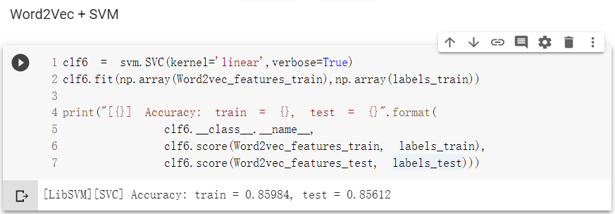
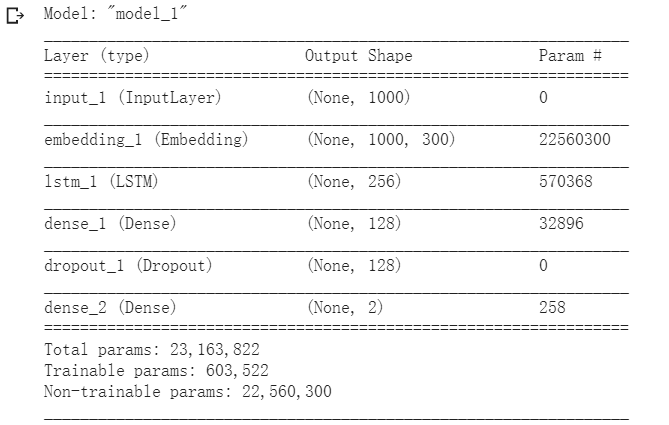
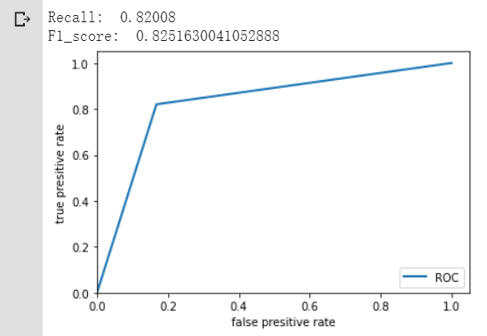

# IMDB_Review_Classification / IMDB 评论情感分类
Preprocess with bag of Word, TF-IDF, word2vec respectively. Classification with Naive Bayes, SVM, LSTM respectively. Dataset: http://ai.stanford.edu/~amaas/data/sentiment/


### 1.3 实验环境

#### 1.3.1 运行环境

操作系统

- Windows 10
- Linux

程序语言：python 3.7

IDE

- Pycharm Community 2019.2.3
- Jupyter Notebook
- Colab

#### 1.3.2 实验中用到的模块

numpy、pandas、pickle、matplotlib

Keras、sklearn、gensim


## 2 实验内容

### 2.1 数据收集

​		 数据集：Large Movie Review Dataset  http://ai.stanford.edu/~amaas/data/sentiment/

​		该电影评论数据集是用于二元情感分类的数据集，由斯坦福大学人工智能实验室提供，其包含的数据比以前的基准数据集要多得多。其中包含 25,000 个训练数据和 25,000 个测试数据，训练集和测试集又分别包含12,500条正例（正向评价pos）和12,500负例（负向评价neg）。另外还有50,000条无标签的辅助数据。每个电影的评论不超过三十条，因为同一个电影的评论可能具有相关性。

​		解压后目录结构如下：


​		文件夹train和test分别包含了pos和neg文件夹，分别存放了12,500条正例和12,500负例，一共是50,000有标签样本。另外train/unsup文件夹存放了50,000条无标签的辅助数据。

​		每个评论的IMDb网址单独放在[urls_ [pos，neg，unsup] .txt]文件中。此外还包含已经 tokenized bag of words 的特征，但这些我在本次实验中没有用到。


​		样本文件示例如下，每个文件含有一个样本


​		样本示例如下：一个样本只有一个属性，是一条电影评论，类型是字符串，该属性保存在一个txt文件里；一个样本对应一个txt文件，文件中只有一行文字（一条电影评论）；样本的标签由文件夹pos或neg确定。


​		打印一个样本及其标签：


### 2.2 数据预处理

#### 2.2.1 数据清洗

数据清洗实现的主要函数是`review_to_word()`，包含以下内容

1. 删除HTML标签：原始数据包含一些HTML标签，例如`<br />`，使用 BeautifulSoup 模块将这些标签删除。
2. 删除非英文符号：使用 String 的 punctuation 模块删除标点符号
3. 分词：将句子划分为单词
4. 去停用词：使用 nltk 的 stopwords 词库删除停用词。
5. 词干提取（Porter Stemmer）：使用 `nltk.stemmer.porter.PorterStemmer`提取词干。Porter stemmer 并不是要把单词变为规范的那种原来的样子，它只是把很多基于这个单词的变种变为统一的形式。例如"created"不一定能还原到"create"，但却可以使"create" 和 "created" ，都得到"creat"。这种处理方式在Bag of Word和TF-IDF中是有积极作用的，但在Word2Vec中可能会导致结果更差，因为使用 Porter stemmer 处理后会导致单词拼写错误，无法找到对应的词向量。所以使用了两种数据清洗方法，一个使用了Porter stemmer 另一个不使用。

处理完的数据示例如下：


#### 2.2.2 文本向量化

文本向量化使用了三种方法，分别是词袋预处理技术（Bag of Word）、词频-逆文档频率（TF-IDF）预处理技术、word2vec词向量

##### 2.2.2.1Bag of Word

###### 原理

​		Bag of words将文本中的词语转换为词频矩阵。对于一个文本，Bag of words忽略其词序和语法、句法，仅仅将其看做是一些词汇的集合，而文本中的每个词汇都是独立的。

###### 实现

​		使用 `sklearn.feature_extraction.text.CountVectorizer()` 函数实现Bag of Word。

​		仅使用训练集生成 Bag of Word 的词汇表，用于将训练数据和测试数据转换为向量表示。需要选择合适的词汇量（这里选择5000），过大会导致矩阵维度过高训练缓慢，过小会丢失文本的信息。

​		训练集中的单词集可能与测试集中的单词集不完全相同，如果在转换训练集时遇到了词汇表中没有的单词，则将其忽略。

​		每次生成Bag of Word特征向量文件就将其存储到文件，下次使用Bag of Word特征向量文件直接读取，避免每次都要训练和生成Bag of Word特征向量。

​		此外还需要将 Bag of Word特征向量规范化，因为`CountVectorizer()`只是对单词计数，数值可能会相差很大，会影响后续学习过程。使用`sklearn.preprocessing.pr.normalize()` 将数值规范化。

​		使用 Bag of Word 生成的特征向量如下，是高维稀疏矩阵，本实验中词汇表的词汇量设定为5000，训练集和测试集分别有25000条样本，则测试集和训练集分别对应一个25000 x 5000 的稀疏矩阵。


##### 2.2.2.2 TF-IDF

###### 原理

**TF-IDF(Term Frequency-Inverse Document Frequency, 词频-逆文档频率) **TF-IDF是一种评估一字词对于一个文件集或一个语料库中的其中一份文件的重要程度的方法。词的重要性随着它在文件中出现的次数成正比增加，但同时会随着它在语料库中出现的频率成反比下降。即一个词语在一篇文章中出现次数越多, 同时在所有文档中出现次数越少，越可能是文章的中心词汇，该词的权重越大。TF-IDF能够过滤掉常见的词语，保留重要的词语。

**词频 (term frequency, TF)**  指的是某一个给定的词语在该文本中出现的次数

**逆向文件频率 (inverse document frequency, IDF)** 体现所有文档包含该词的比例，IDF越大说明包含该词的文档越少，计算公式如下：
$$
IDF_w=ln(\frac{语料库的文档总数+1}{包含词条w的文档数+1})+1
$$
**TF-IDF** 计算公式：
$$
TF−IDF=TF∗IDF
$$

###### 实现

​		使用 `sklearn.feature_extraction.text.TfidfVectorizer()` 函数实现TF-IDF，其余部分与上面的Bag of Word 实现差不多。

同样仅使用训练集生成的词汇表，然后将训练集和测试集转换为特征矩阵，并将特征矩阵存储到文件，最后将 TF-IDF 特征向量规范化。

​		使用 TF-IDF 生成的特征向量如下，是高维稀疏矩阵，本实验中词汇表的词汇量设定为5000，训练集和测试集分别有25000条样本，则测试集和训练集分别对应一个25000 x 5000 的稀疏矩阵。


##### 2.2.2.3 Word2Vec

###### 原理

​		Word2Vec，是一群用来产生词向量的相关模型。这些模型为浅层双层的神经网络，可以分为skip-grams和CBOW两种模型。训练完成之后，word2vec模型可以把每个词映射到一个向量，来表示词与词之间的关系。该向量为神经网络的隐藏层。

l 说明用的几种分类算法的设计思路，对代码流程进行伪代码或流程图的算法说明。

l 说明实现时主要用了哪些包哪些接口完成哪些功能，说明训练集、校验集、测试集怎么分的，最优的模型的参数或模型结构是多少，嵌入维用的多少。

###### 实现

​		使用了Google预训练的单词和短语向量，该模型是在发布在Google新闻数据集的一部分（约1000亿个单词）上经过训练的预训练向量，模型包含用于300万个单词和短语的300维向量。模型下载地址

[GoogleNews-vectors-negative300.bin.gz]: https://drive.google.com/file/d/0B7XkCwpI5KDYNlNUTTlSS21pQmM/edit?usp=sharing

​		模型下载方式如下：

```python
from pydrive.auth import GoogleAuth
from pydrive.drive import GoogleDrive
from google.colab import auth
from oauth2client.client import GoogleCredentials

# Authenticate and create the PyDrive client.
# This only needs to be done once per notebook.
auth.authenticate_user()
gauth = GoogleAuth()
gauth.credentials = GoogleCredentials.get_application_default()
drive = GoogleDrive(gauth)

file_id = '0B7XkCwpI5KDYNlNUTTlSS21pQmM'
downloaded = drive.CreateFile({'id':file_id})
downloaded.FetchMetadata(fetch_all=True)
downloaded.GetContentFile(downloaded.metadata['title'])
```

使用gensim将模型载入内存

```python
word2vec = models.KeyedVectors.load_word2vec_format(
    '/content/drive/My Drive/Colab Notebooks/GoogleNews-vectors-negative300.bin', binary=True)
```

使用Word2Vec表示文本

​		要在Naive Bayes 和 SVM 分类器中使用Word2Vec表示句子，需要将词向量序列转换为一个向量。使用Word2Vec表示句子的方法有很多，《Comparing Sentence Similarity Methods》一文中列举了一些方法和性能比较，如下图所示。本实验采用的是 去停用词+平均词向量+Word2Vec的方法。


计算平均词向量：

​		如果模型中有这个词，则将其转换为向量，否则生成一个随机数数组作为这个词的词向量。将一个文本的所有词向量加和求平均得到该文本的向量表示，最终一个样本对应300维的向量。

```python
def get_average_word2vec(tokens_list, vector, generate_missing=False, k=300):
    if len(tokens_list)<1:
        return np.zeros(k)
    if generate_missing:
        vectorized = [vector[word] if word in vector else np.random.rand(k) for word in tokens_list]
    else:
        vectorized = [vector[word] if word in vector else np.zeros(k) for word in tokens_list]
    length = len(vectorized)
    summed = np.sum(vectorized, axis=0)
    averaged = np.divide(summed, length)
    return averaged
```

​		使用Word2Vec处理文本示例如下，可以看到向量是稠密的，并且矩阵比Bag of Word 和 TF-IDF 生成的矩阵小很多，每个样本对应300维的矩阵，训练集和测试集分别有25000条样本，则测试集和训练集分别转换为一个25000 x 300  的稠密矩阵。

【图】


### 2.3 数据挖掘

数据挖掘方法使用了Naive Bayes和SVM这两种经典机器学习算法，和LSTM 这一种深度学习算法。


#### 2.3.1 Naive Bayes

##### （1）原理

假设有N种可能类别标记，即${c_1,c_2,...c_N}$，$\lambda_{ij}$是将真实样本$c_j$错误分类为$c_i$的损失，基于后验概率$P(c_i|x)$可获得样本x分类为$c_i$所产生的期望损失，也就是条件风险：


根据贝叶斯判断准则，为最小化总体风险，只要选择每个样本上能使条件风险最小的标记c，即


上式为贝叶斯最优分类器。对于最小化分类错误率，误判损失$\lambda_{ij}$如下：


此时，条件风险满足：


所以最小化分类错误率的贝叶斯最优分类器为：


朴素贝叶斯假设所有属性相互独立，基于该假设，$P(c|x)$可重写为：
$$
P(c|x)=\frac{P(c)P(x|c)}{P(x)}=\frac{P(c)}{P(x)}\prod^d_{i=1}P(x_i|c)
$$
朴素贝叶斯分类器的表达式为：


##### （2）实现

​		调用`sklearn.naive_bayes.GaussianNB`高斯朴素贝叶斯函数进行二分类，使用方法`fit()`训练集训练高斯朴素贝叶斯分类器，并使用`score()`在训练集和测试集上评估它的分类准确率。

##### （3）代码及运行结果

###### Bag of Word + 朴素贝叶斯

分类准确率 : train = 0.81828, test = 0.72364


召回率=0.61888、F1值 =0.69130、ROC曲线如下


###### TF-IDF + 朴素贝叶斯

分类准确率 : train = 0.82752, test = 0.73092


召回率=0.5788、F1值 =0.6860、ROC曲线如下


###### Word2Vec + Naive Bayes

​		训练集上的准确率： 0.7776，测试集上的准确率： 0.77404，Recall:  0.75256 ，F1_score:  0.769079，使用Word2Vec预处理文本的结果稍好于使用Bag of Word 和 TF-IDF预处理。


#### 2.3.2 SVM

##### （1）原理

支持向量机（support vector machines, SVM）是一种二分类模型，它的基本模型是定义在特征空间上的**间隔最大的线性分类器**，间隔最大使它有别于感知机；SVM还包括**核技巧**，这使它成为实质上的非线性分类器。SVM的的学习策略就是间隔最大化，可形式化为一个求解凸二次规划的问题，也等价于正则化的合页损失函数的最小化问题。SVM的的学习算法就是求解凸二次规划的最优化算法。

SVM学习的基本想法是求解能够正确划分训练数据集并且几何间隔最大的分离超平面。


距离超平面最近的样本点为**支持向量**，两个异类样本点到超平面的距离之和为
$$
γ=\frac{2}{||\omega||}
$$
它被称为间隔（margin）。SVM模型的求解最大分割超平面问题可以表示为以下约束最优化问题


等价于以下约束最优化问题


上式就是支持向量机的基本型，是一个凸二次规划问题，可以对其使用拉格朗日乘子法得到其对偶问题（dual problem），再用序列最小优化（SMO）算法求解。

##### （2）算法优缺点

支持向量机的优点是：

- 在高维空间有效。

- 在维数大于样本数的情况下仍然有效。

- 在决策函数中使用训练点的子集（支持向量），因此它高效利用内存。

- 多功能：可以为决策功能指定不同的内核功能。提供了通用内核，但是也可以指定自定义内核。


支持向量机的缺点包括：

- 如果特征数量远大于样本数量，则在选择内核函数时应避免过度拟合，并且正则化项至关重要。

- SVM不直接提供概率估计，而是使用耗时的五倍交叉验证来计算的。


##### （3）实现

调用`sklearn.svm.SVC() `C-支持向量机（C-Support Vector Classification）进行二分类，核函数使用的是线性核函数（linear）。使用方法`fit()`训练集训练高斯朴素贝叶斯分类器，并使用`score()`在训练集和测试集上评估它的分类准确率。

`sklearn.svm.SVC()`函数原型如下 

```python
class sklearn.svm.SVC(*, C=1.0, kernel='rbf', degree=3, gamma='scale', coef0=0.0, shrinking=True, probability=False, tol=0.001, cache_size=200, class_weight=None, verbose=False, max_iter=-1, decision_function_shape='ovr', break_ties=False, random_state=None)
```


##### （4）代码及运行结果

###### Bag of Word + SVM

准确率：train = 0.91364, test = 0.87624


召回率=0.8776、F1值 =0.8763、ROC曲线如下


###### TF-IDF + SVM

准确率：train = 0.92604, test = 0.87472


召回率=0.8776、F1值 =0.8763、ROC曲线如下


###### Word2Vec + SVM

训练集上准确率为 0.85984，测试集上准确率为 0.85612，准确率略差于TF-IDF + SVM的训练结果。



Recall:  0.85872，F1_score:  0.8564、ROC曲线如下


#### 2.3.3 传统机器学习算法小结

不同的预处理方法和传统机器学习算法组合的模型在训练集和测试集上的分类准确率如下：

| 分类算法\文本预处理算法 | Bag of Word                     | TF-IDF                          | Word2Vec                        |
| ----------------------- | ------------------------------- | ------------------------------- | ------------------------------- |
| Naive Bayes             | train = 0.81828, test = 0.72364 | train = 0.82752, test = 0.73092 | train = 0.7776, test = 0.77404  |
| SVM                     | train = 0.91364, test = 0.87624 | train = 0.92604, test = 0.87472 | train = 0.85984, test = 0.85612 |

​		可以看到，整体上 SVM 的分类准确率优于 Naive Bayes ，预处理方法 TF-IDF 优于 Bag of Word，这样的结果是符合认知的，因为 Bag of Word 只计词频，不计单词在语料库中出现的频率，然而频率高的词可能是常见的词汇，不能代表文章中心；而TF-IDF 考虑了词频和逆文档频率，能够过滤掉常见的词语，保留重要的词语，因此使用TF-IDF 向量化文本效果更好。

​		此外，本实验在使用 Bag of Word 和 TF-IDF 处理文档之前已经去除了文档的停用词，如果不去除停用词，Bag of Word 和 TF-IDF 训练效果的差距应该更明显，因为停用词是在文档和语料库中大量出现并且不是文章中心词的词， Bag of Word 会赋予这些词高权重，而 TF-IDF 会赋予这些词低权重，使用 Bag of Word 预处理数据训练效果会更差。


#### 2.3.4 LSTM

##### （1）原理

​		长短期记忆（Long short-term memory, LSTM）是一种特殊的RNN，主要是为了解决长序列训练过程中的梯度消失和梯度爆炸问题。简单来说，就是相比普通的RNN，LSTM能够在更长的序列中有更好的表现。

​		相比RNN只有一个传递状态 ![[公式]](https://www.zhihu.com/equation?tex=h%5Et+) ，LSTM有两个传输状态，一个 ![[公式]](https://www.zhihu.com/equation?tex=c%5Et) （cell state），和一个 ![[公式]](https://www.zhihu.com/equation?tex=h%5Et) （hidden state）。其中对于传递下去的 ![[公式]](https://www.zhihu.com/equation?tex=c%5Et) 改变得很慢，通常输出的 ![[公式]](https://www.zhihu.com/equation?tex=c%5Et) 是上一个状态传过来的 ![[公式]](https://www.zhihu.com/equation?tex=c%5E%7Bt-1%7D) 加上一些数值。而 ![[公式]](https://www.zhihu.com/equation?tex=h%5Et) 则在不同节点下往往会有很大的区别。


##### （2）实现

###### 训练集、校验集、测试集划分

​		虽然校验集不会参与训练网络，但是也不能将测试集直接作为校验集，否则神经网络会记住测试集，影响测试的真实性。所以将训练集打乱后划分出10%作为校验集，测试集为原数据里划分好的测试集，共有22500个样本作为训练集，2500个样本作为校验集，25000个样本作为测试集。


###### 代码简述

代码包含以下几部分：

- 将文本序列化

- 计算 Embedding Layer 参数矩阵

- 构建LSTM

- 训练LSTM

- 测试LSTM

  

（1）将文本序列化

这部分代码将文本转换为序列

获取所有词汇和词汇表，以及最长的文本单词数：

- 训练集共2989070个词，词汇表单词个数为75200，最长的文本单词数1416
- 测试集共2919765个词，词汇表单词个数为74367，最长的文本单词数1154


使用Keras的Tokenizer类将训练集和测试集的文本转换为序列，保存序列和单词与索引的对应关系（tokenizer.word_index)

```
tokenizer = Tokenizer(num_words=len(TRAINING_VOCAB), lower=True, char_level=False)
tokenizer.fit_on_texts(data_train["Text_Final"].tolist())
training_sequences = tokenizer.texts_to_sequences(data_train["Text_Final"].tolist())
train_word_index = tokenizer.word_index
```

​		由于使用Tokenizer类将文本转换成序列后序列的长度是不一定的，取决于文本的长度，需要将序列填充成相同的长度。填充的长度需要调整，序列长度过小则会损失很多样本的信息，导致训练结果不好；过大会导致网络训练过于缓慢。当设置序列长度为50时，训练完成后在测试集上的分类准确率只有大约80%，说明序列过小损失了太多信息；当设置序列长度为1416时，每个epoch预计需要一个多小时，共10个epoch，虽然结果可能不错，但是训练时间太长了。

```
train_cnn_data = pad_sequences(training_sequences, maxlen=MAX_SEQUENCE_LENGTH)
```

（2）计算 Embedding Layer 参数矩阵

​		Embedding Layer 将高维的稀疏的词的编码转换为低维稠密的向量，用于后续输入LSTM


​		计算词嵌入矩阵，抽取训练集词汇表中的单词对应的预训练的Word2Vec的词嵌入矩阵的部分。方法是遍历词汇表中的每个单词，如果 预训练的Word2Vec模型中有这个词，则将这个词的向量表示作为embedding矩阵的一行；否则随机生成一个数组作为这个词的向量表示。这样使用更小的词嵌入矩阵，可以使模型更小，输入向量长度也更小。

```python
train_embedding_weights = np.zeros((len(train_word_index)+1, EMBEDDING_DIM))
for word,index in train_word_index.items():
    train_embedding_weights[index,:] = word2vec[word] if word in word2vec else np.random.rand(EMBEDDING_DIM)
```

（3）建立LSTM

​		使用了Keras的Sequential、Input、Embedding、LSTM、Dense、Dropout函数构建LSTM

​		首先是input layer，输入一个MAX_SEQUENCE_LENGTH维的文本序列（例如下图的输入维数是1000），经过一个embedding层用Word2Vec将1000维的稀疏向量转换为300的稠密向量，该层抽取自预训练的Word2Vec模型，所以参数不需要训练；然后是一个有256个神经元的LSTM，之后再接一个128个神经元的全连接网络，20%的节点Dropout，最后输出层做二分类。

​		损失函数是二元交叉熵损失函数，优化器是‘adam’，优化目标是分类准确率。

```python
def recurrent_nn(embeddings, max_sequence_length, num_words, embedding_dim, labels_index):
    sequence_input = Input(shape=(max_sequence_length,), dtype='int32')
    
    embedding_layer = Embedding(num_words,
                  embedding_dim,
                  weights=[embeddings],
                  input_length=max_sequence_length,
                  trainable=False)
    embedded_sequences = embedding_layer(sequence_input)
    lstm = LSTM(256)(embedded_sequences)
    
    x = Dense(128, activation='relu')(lstm)
    x = Dropout(0.2)(x)
    preds = Dense(labels_index, activation='sigmoid')(x)

    model = Model(sequence_input, preds)
    model.compile(loss='binary_crossentropy',
                  optimizer='adam',
                  metrics=['acc'])
    model.summary()
    return model
```

构建完毕模型如下：




（4）训练LSTM

​		设置不同的 epoch 和 batch size，调用`model.fit()`传入训练集，开始训练神经网络。


（5）测试LSTM

​		使用`model.predict()`对训练集进行预测，并将预测结果与真实标签比较，计算预测准确率、召回率、F1 score，并画出ROC曲线。


###### 运行结果

（1）使用 poter stemmer 清洗数据，将每个样本转换为长度为50的序列，词嵌入用预训练的 Google word2vec ，神经网络为 LSTM

batch size为64，epoch数量为10

网络结构如下：


训练过程（大约21分钟）：


在测试集上的准确率为0.79064：


​		测试集的准确率并不算太高，可能原因是预处理时使用了用于单词词干提取的Porter stemmer算法。Porter stemmer 并不是把单词变为原型，它只是把很多基于这个单词的变种变为统一的形式。例如"created"不一定能还原到"create"，但却可以使"create" 和 "created" ，都得到"creat"。这种处理方式在Bag of Word和TF-IDF中是有积极作用的，但在Word2Vec中可能会导致结果更差，因为使用 Porter stemmer 处理后会导致单词拼写错误，无法找到对应的词向量。

​		下图所示是用Porter stemmer 处理过的训练集，可以看到有不少单词拼写错误：


（2）不改变神经网络结构，改变数据预处理方式，不使用 Porter stemmer 预处理数据，训练结果如下：

​		在训练集上准确率为 0.9665 ，在测试集上准确率为 0.82624，准确率有所提高，召回率:  0.82008，F1_score:  0.8251630041052888。

​		结论：使用预训练的 Word2Vec 进行词嵌入时，不建议使用 Porter stemmer 预处理文本。





（3）将每个样本转换为长度为1000的序列，其余同上

​		观察样本可以发现最长的训练集样本有1416个词，将文本转换为长度为50的序列显然丢失了过多文本信息，因此增长文本序列长度，保留更多文本信息，有希望获得更好的结果。

​		修改后的模型如下：


​		训练过程（大约4个小时）（batch size：32，epoch数量：5）


​		结果：在训练集上准确率为0.9023，测试集上准确率为0.88612，召回率:  0.89744，F1_score:  0.88739。

​		分析：增加文本序列长度能够保留更多文本信息，序列长度为1000的训练结果相较输入序列长度为50的结果有较大提升，但是训练时间大幅增加。


（4）增加训练轮数

​		同样的网络结构，训练10个epoch，在训练集上准确率提高到了为0.9768，损失下降到了0.0608，但是在测试集上准确率并没有升高，反而稍微下降了一点，为0.87596，并且召回率和F1 score均有下降；后5个epoch在验证集上的准确率也有点下降，可能出现了过拟合。因此训练轮数在5轮左右较好。

​		后5个epoch训练过程如下图所示：


​		结果：在训练集上准确率为0.9768，测试集上准确率为0.87596，召回率:  0.88256，F1_score:  0.8767732962447845


### 2.4 总结

在训练集和测试集上的准确率：

| 分类算法\文本预处理算法 | Bag of Word                     | TF-IDF                          | Word2Vec                        |
| ----------------------- | ------------------------------- | ------------------------------- | ------------------------------- |
| Naive Bayes             | train = 0.81828, test = 0.72364 | train = 0.82752, test = 0.73092 | train = 0.7776, test = 0.77404  |
| SVM                     | train = 0.91364, test = 0.87624 | train = 0.92604, test = 0.87472 | train = 0.85984, test = 0.85612 |
| LSTM                    | BoW不适用于LSTM                 | TF-IDF不适用于LSTM              | train = 0.9023，test = 0.88612  |

- 不同预处理方法对分类模型效果影响

  ​		对于 Bag of Word 、TF-IDF、Word2Vec 这三种文本处理方法，Word2Vec 是最好的，TF-IDF 次之，Bag of Word 最差。Word2Vec 将单词映射到低维稠密的向量，具有良好的语义特性，每一维表示词语的一个潜在特征，该特征捕获了有用的句法和语义特性；TF-IDF、Word2Vec都将单词映射到高维稀疏向量，并且不具有语义， Bag of Word 只计词频，不计单词在语料库中出现的频率，会赋予常用的不重要的词汇高权重；TF-IDF 是Bag of Word的优化，考虑了词频和逆文档频率，能够过滤掉常见的词语，保留重要的词语。

  

- 比较不同模型分类效果

  分类准确率：LSTM > SVM > Naive Bayes

  ​		LSTM 适合处理序列变化的数据，对于文本类型的数据，可以将文本切分为单词，每个单词用向量表示，LSTM输入词向量表示的文本序列，能够发掘序列中数据的依赖关系。

  ​		对于SVM 和 Naive Bayes，只能将文本转化为一个向量表示，不能捕捉到序列的变化过程，不适用于处理序列的输入。
  
  

​        使用Word2Vec + LSTM的结果是最好的，这种方法在预测集上的准确率最高，并且召回率和F1 score均较大，说明此时精确率和召回率均较大，AUC较大，模型性能较好。Word2Vec 能够表示词的语义，LSTM较为适合处理序列变化的数据，能够发掘序列中数据的依赖关系，二者结合能够较好地分析文本序列。


****

参考文献：

[1] Comparing Sentence Similarity Methods. Yves Peirsman, https://nlp.town/blog/sentence-similarity/. 2018-05-02

[2] 1.4. Support Vector Machines; https://scikit-learn.org/stable/modules/svm.html; 

[3] sklearn.naive_bayes.GaussianNB; https://scikit-learn.org/stable/modules/generated/sklearn.naive_bayes.GaussianNB.html

[4] keras LSTM layer; https://keras.io/api/layers/recurrent_layers/lstm/
